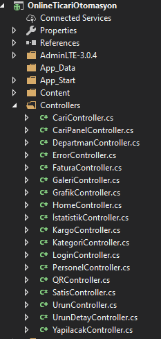
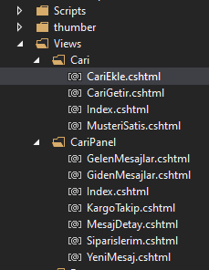
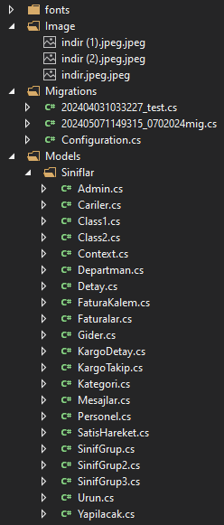
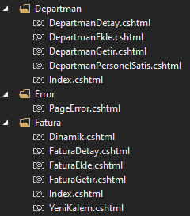
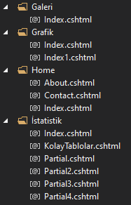
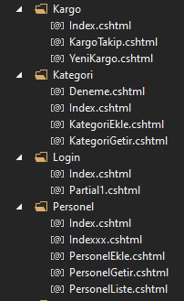
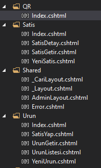
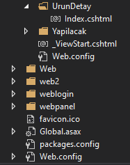

# Online-Ticari-Otomasyon

MATERYAL VE YÖNTEM

Kullandığım programlama dilleri : C# , Asp.NET , CSS , HTML 

Kullandığım Yazılım Mimarisi : Mvc , Katman yapısı 

Kullandığım veritabanı : MSSQL

MVC Katman yapısını kullanarak Models kısmında Sınıflarımı , View kısmında .cshtml 
uzantısı ile yani görünümlerimi oluşturdum ve Controller kısmında oluşturmam gereken 
sınıfların controllerlarını oluşturarak projemin katman yapısını oluşturmuş oldum.

Tasarım için gerekli olan bölümleri projeme klasör olarak ekledim 
(weblogin,webpanel,thumber,web,web2) ve bu kısımlar üzerinde değişiklikler yaparak 
projeme uygun hale getirdim.
 
Projem de bazı Sql terimlerini ve gerekli olan komutları kullanarak projemi daha verimli ve tekrarsız bir şekilde oluşturdum.
( Distinct() , Count() , Sum() , UPDATE , SELECT , DELETE , İNSERT )

Bu şekilde katman yapısını oluşturup işlemlerim için gerekli olan controller, view ve class yapılarını projede kullanarak projemi oluşturdum. 

